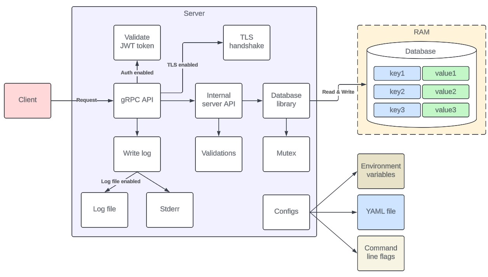

# Overview


HakjDB is a simple in-memory key-value data store that was built as an educative hobby project. It is written in the Go programming language.

HakjDB allows you to store key-value pairs of different data types in namespaces called databases. The data is stored in the server's memory.

HakjDB uses a simple client-server model, and has a well-defined and documented gRPC API. It can be used as a temporary database, session storage or cache. It may not be suitable for advanced needs, and does not offer data persistence on disk.

Data is stored at keys of different types. Each data type allows you to store different kind of data such as string values or objects.

Instances are easily configurable with command line flags, environment variables and a simple YAML file.

Components:
- `hakjserver` - The server process
- `hakjctl` - CLI tool to control and interact with the server
- [`hakjdb-gui`](https://github.com/hollowdll/hakjdb-gui) - Cross-platform GUI desktop application to visually interact with the server

This is not meant for production use, as it lacks a lot of features, and is not as professional as some popular key-value stores.

# How it works

The following diagram shows the architecture



# Documentation

- [Using the server](./docs/hakjserver.md)
- [Using the CLI](./docs/hakjctl.md)
- [Configuring the server](./docs/configuration.md)
- [Databases](./docs/databases.md)
- [Data types](./docs/datatypes.md)
- [API](./docs/api.md)

# Releases

Release notes are available [here](./docs/changelog/).

Prebuilt binaries are available for download. Multiple platforms supported. You can download them [here](https://github.com/hollowdll/hakjdb/releases).

However, it is recommended to build the binaries from source or install them with Go.

Releases are managed with [GoReleaser](https://goreleaser.com/).

NOTE: This project went by name kvdb before v1.0.0. That's why name kvdb appears in older releases.

# Install binaries

The binaries can be installed with Go.

Install the server binary
```sh
go install github.com/hollowdll/hakjdb/cmd/hakjserver@latest
```

Install the CLI binary
```sh
go install github.com/hollowdll/hakjdb/cmd/hakjctl@latest
```

These will install the binaries to your Go bin directory. It is recommened to create separate directories for the binaries and then place the binaries in these directories because the binaries create some files relative to their parent directory.

For example on Linux
```sh
mkdir -p ~/hakjdb/hakjserver
mkdir -p ~/hakjdb/hakjctl
mv hakjserver ~/hakjdb/hakjserver
mv hakjctl ~/hakjdb/hakjctl
```

# Build binaries

To build the binaries from source, you first need to install Go. Minimum version required is go1.22.

Instructions for installing Go can be found [here](https://go.dev/doc/install).

You may also need tools to work with gRPC and Protocol Buffers in Go. This is needed if you want to compile `.proto` files and generate Go code.

- [Protocol Buffer compiler](https://github.com/protocolbuffers/protobuf#protobuf-compiler-installation)
- [Quickstart](https://grpc.io/docs/languages/go/quickstart/)

If you just want to compile the binaries then installing only Go is enough.

After you have successfully installed go, clone this repository.

Cloning with git:
```sh
git clone https://github.com/hollowdll/hakjdb.git
```

Note: You can also download the source code for a specific release [here](https://github.com/hollowdll/hakjdb/releases).

Change directory to the project root:
```sh
cd hakjdb
```

Get the dependencies:
```sh
go mod tidy
```

Build the server:
```sh
go build -o ./bin/hakjserver/ ./cmd/hakjserver/
```

Build the CLI:
```sh
go build -o ./bin/hakjctl/ ./cmd/hakjctl/
```

These will build the binaries to `bin/` directory in the project root. You can change the output directory and binary names to whatever you like by modifying the path with `-o` flag.

For more advanced build, use `go help build` to see more build options.

You can also use the scripts `build_hakjctl.sh` and `build_hakjserver.sh` to build the binaries.

# Docker

Images are available in Docker Hub with multiple tags. Links below.

- [Repository](https://hub.docker.com/r/hakj/hakjdb)
- [Old repository](https://hub.docker.com/r/hakj/kvdb)


## Pull the server image

```sh
docker pull hakj/hakjdb
```

## Build the server image

Make sure to be in the project root
```sh
cd hakjdb
```
Latest tag
```sh
docker build -f "./Dockerfile.bookworm" -t hakjdb:latest .
```
Debian based image
```sh
docker build -f "./Dockerfile.bookworm" -t hakjdb:bookworm .
```
Alpine Linux based image
```sh
docker build -f "./Dockerfile.alpine" -t hakjdb:alpine .
```

These commands build the image only for a single architecture. If you want to build multi-arch images for other platforms, read [this](https://docs.docker.com/build/building/multi-platform/).

## Start a container

Example of starting a container
```sh
docker run -p 12345:12345 --rm -it hakjdb
```
This binds the host's port `12345` to the container's port `12345` so you can access the server outside the container.

# Running tests

Change directory to the project root:
```sh
cd hakjdb
```

Run all tests:
```sh
go test ./...
```

Run only integration tests:
```sh
go test ./tests/integration
```

Show verbose test result output:
```sh
go test -v ./...
```

## Integration tests

Running the integration tests starts test servers both with and without TLS. The servers are stopped after the tests have finished. 

The operating system assigns random TCP ports for the test servers. You can output the assigned ports to the console by running the integration tests with `-v` flag.

For example:
```sh
go test -v ./tests/integration
```

## Benchmarks

Benchmarks are useful for testing the average performance of the server. They can measure the average number of requests that can be performed in a second.

Run benchmarks:
```sh
cd tests/benchmark
go test -bench=. -v
```

Results show that the best performance is achieved when not using authentication or TLS. They reduce the throughput a little bit. Benchmarks were done for String key writes and reads. They have about the same average performance.

Benchmarks were run with Intel Ultra 7 155H CPU and requests were handled in parallel using goroutines.

Average results are shown in the table below

Auth enabled | TLS enabled | Average requests per second
-------------|-------------|----------------------------
No           | No          | ~33000
Yes          | No          | ~24000
Yes          | Yes         | ~22000

# License

This project is licensed under MIT license. It is free and open source software.
